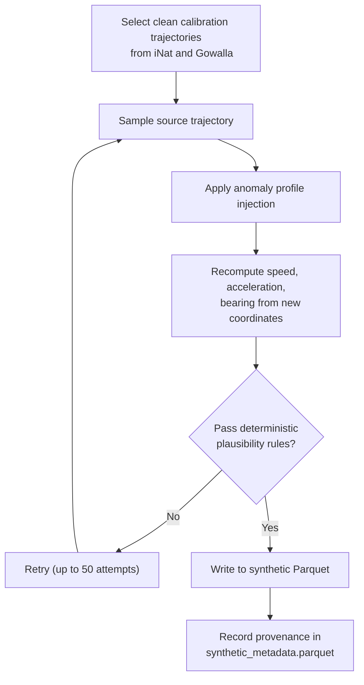
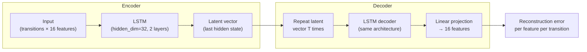
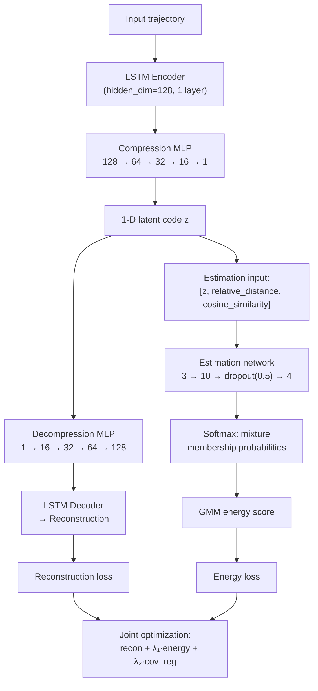
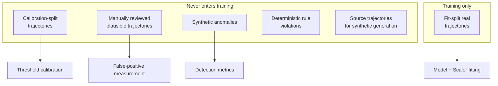
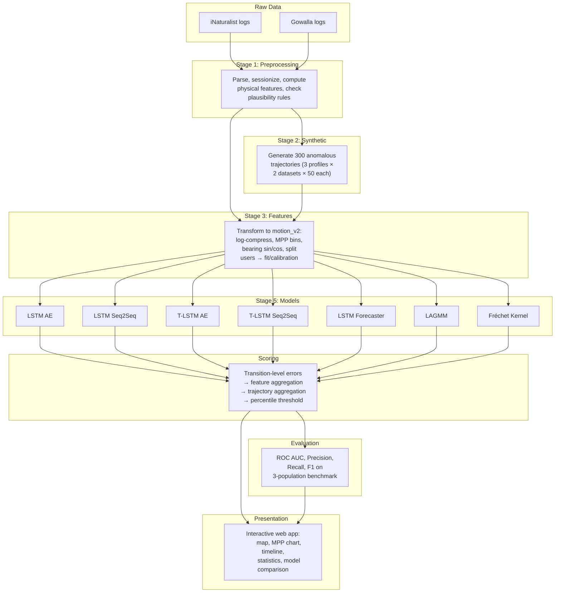

# Motion Plausibility Profiles — Pipeline, Models & Results Presentation

This document describes the complete processing pipeline implemented in the project, the anomaly detection models it trains, and how model outputs are surfaced in the interactive visualization.

---

## 1. Pipeline Overview

The pipeline is orchestrated by [pipeline.py](../pipeline.py) and runs six stages in strict dependency order:


The complete rebuild command is simply:

```bash
python pipeline.py                     # rebuild everything
python pipeline.py --dry-run           # preview the commands
python pipeline.py --from-stage models # resume from a specific stage
```

---

## 2. Stage 1 — Raw Log Preprocessing

**Entry point:** [preprocess_logs_to_parquet.py](../dataset_preprocessing/ingestion/preprocess_logs_to_parquet.py)

### 2.1 Input Data

The project consumes location logs from two citizen-science / social-network datasets:

| Dataset | Log file | Source |
|---------|----------|--------|
| **iNaturalist** | `data/raw/iNaturalist/frequent-poster.log` | Biodiversity observation platform |
| **Gowalla** | `data/raw/gowalla/gowalla_frequent_poster.log` | Location-based social network |

Each log file contains per-user, per-day sequences of geolocated observations with timestamps, coordinates, and metadata.

### 2.2 Canonical Parquet Tables

The preprocessor parses every log file and emits four normalized tables per dataset:

| Table | Granularity | Key columns |
|-------|-------------|-------------|
| `observations.parquet` | One row per GPS point | `dataset`, `user_id`, `observation_id`, `timestamp`, `lat`, `lon`, `is_obscured` |
| `transitions.parquet` | One row per movement between consecutive points | `speed_kmh`, `elapsed_time_s`, `distance_m`, `acceleration_m_s2`, `bearing_change_rad`, `transition_plausibility` |
| `trajectories.parquet` | One row per trajectory | `trajectory_id`, `user_id`, `n_transitions`, `start_observation_id`, `end_observation_id` |
| `trajectory_transitions.parquet` | Join table preserving transition order | `trajectory_id`, `transition_order`, `transition_id` |

### 2.3 Trajectory Sessionization

A calendar day is not automatically one trajectory. The preprocessor splits a user-day into multiple trajectory sessions when consecutive observations are separated by more than **6 hours** of inactivity (configurable via `--max-inactivity-hours`). The transition spanning the inactivity gap is not stored. This is implemented in [sessionization.py](../dataset_preprocessing/features/sessionization.py).

### 2.4 Deterministic Transition Plausibility Rules

Each transition is checked against hardcoded physical constraints in the [transition_plausibility](../dataset_preprocessing/ingestion/preprocess_logs_to_parquet.py#L146-L175) function. Any trajectory containing a rule-violating transition is excluded from model training and feature generation. The rules include:

| Rule | Threshold |
|------|-----------|
| Maximum speed | > 900 km/h (~Mach 1) |
| Maximum acceleration | > 50 m/s² (~5 g) |
| Maximum elapsed time | > 24 hours |
| Maximum distance | > 10,000 km |
| Short-interval speed limits | > 30 km/h in ≤ 30 s, > 200 km/h in ≤ 300 s, > 300 km/h in ≤ 3600 s |

Rejected trajectories remain in canonical Parquet and are displayed as **deterministic baseline anomalies** in the visualization, but never enter the ML pipeline.

---

## 3. Stage 2 — Synthetic Anomaly Generation

**Entry point:** [synthetic_anomalies.py](../dataset_preprocessing/synthetic/synthetic_anomalies.py)

Since the project is an unsupervised anomaly detection system, there are no naturally labeled anomalies to train on. Instead, synthetic anomalies are injected into clean real trajectories to create a controlled benchmark.

### 3.1 Anomaly Profiles

Three types of anomalies are generated, **50 trajectories per source dataset per profile** by default:

| Profile | What it simulates | Injection mechanism |
|---------|-------------------|---------------------|
| **`back_and_forth`** | Repeated direction reversals between two nearby locations | Injects ~π-radian bearing reversals for 4–8 consecutive transitions at realistic travel speeds |
| **`abnormal_speed`** | Sudden unrealistic speed burst | Replaces 2–4 transition speeds with values in the 150–180 km/h range |
| **`initial_fix_jump`** | Stale GPS cold-start position | Displaces the first GPS fix by a distance corresponding to 40–90 km/h correction speed, simulating a hardware GPS receiver starting from a cached position |

### 3.2 Generation Process



Key properties:
- Generated from **calibration-split** trajectories only (never from training data)
- Synthetic rows follow the exact same canonical Parquet schema as real data
- Each synthetic trajectory stores provenance in `synthetic_metadata.parquet` (source dataset, source trajectory, anomaly profile, injection boundaries, generation seed)
- Generation is **deterministic** for a given seed

---

## 4. Stage 3 — Feature Engineering

**Entry point:** [build_motion_features.py](../dataset_preprocessing/features/build_motion_features.py)

### 4.1 The `motion_v2` Feature Set

The current feature set transforms raw physical values into model-ready representations. All transformations are applied in the [transform_features](../dataset_preprocessing/features/build_motion_features.py#L83-L112) function:

| Feature | Transformation | Description |
|---------|---------------|-------------|
| `speed` | `log1p(speed_kmh)` | Log-compressed continuous speed |
| `speed_stationary` | `speed == 0` | MPP binary indicator |
| `speed_0_5` | `0 < speed < 5` | MPP speed bin |
| `speed_5_10` | `5 ≤ speed < 10` | MPP speed bin |
| `speed_10_25` | `10 ≤ speed < 25` | MPP speed bin |
| `speed_25_80` | `25 ≤ speed < 80` | MPP speed bin |
| `speed_80_140` | `80 ≤ speed < 140` | MPP speed bin |
| `speed_140_200` | `140 ≤ speed < 200` | MPP speed bin |
| `speed_200_plus` | `speed ≥ 200` | MPP speed bin |
| `elapsed_time` | `log1p(elapsed_time_s)` | Log-compressed time gap |
| `distance` | `log1p(distance_m)` | Log-compressed distance |
| `acceleration` | `sign(a) · log1p(|a|)` | Signed log-compressed acceleration |
| `acceleration_valid` | Boolean → float | First-transition flag (no prior speed) |
| `bearing_sin` | `sin(bearing_change_rad)` | Circular direction change (sine) |
| `bearing_cos` | `cos(bearing_change_rad)` | Circular direction change (cosine) |
| `bearing_valid` | Boolean → float | First-transition flag (no prior bearing) |

The 8 one-hot speed bins form the **Motion Plausibility Profile (MPP)** representation — the project's eponymous contribution. They encode the speed regime as a categorical distribution rather than a single continuous value.

### 4.2 Data Splitting

The feature builder also assigns each trajectory to a **fit** or **calibration** role, based on a deterministic user-level hash split implemented in [splitting.py](../dataset_preprocessing/features/splitting.py):

| Population | Fraction | Role |
|------------|----------|------|
| **Fit** | ~80% of users | Train scalers and models |
| **Calibration** | ~20% of users | Set thresholds and benchmark |

Two specific users (iNaturalist `98904`, Gowalla `16936`) are **hardcoded** into calibration because they contain manually reviewed plausible trajectories.

### 4.3 Output

```text
data/features/motion_v2/
  inat/
    transition_features.parquet    # 16 features per transition
    trajectories.parquet           # trajectory metadata + use_for_training flag
  gowalla/
    transition_features.parquet
    trajectories.parquet
  synthetic/
    transition_features.parquet
    trajectories.parquet
```

Feature Parquet files are deliberately **not normalized**. Each model fits its own `RobustScaler` on only the fit population at training time.

---

## 5. Stage 4 — Dataset Statistics

**Entry point:** [parquet_dataset_stats.py](../dataset_preprocessing/stats/parquet_dataset_stats.py)

Computes distribution summaries and histograms for speed, acceleration, distance, elapsed time, bearing change, and transitions-per-trajectory. Each dataset is reported in two variants:

- **`all`**: every trajectory in canonical Parquet
- **`clean_real`**: only model-eligible trajectories (≥ 2 transitions, all transitions rule-plausible)

Results are written to `artifacts/stats/processed_parquet/` and are consumed by the visualization's Statistics panel.

---

## 6. Stage 5 — Model Training & Evaluation

**Entry point:** [modeling/evaluation/experiments.py](../modeling/evaluation/experiments.py) with config from [current_architecture_three_population.json](../modeling/configs/current_architecture_three_population.json)

### 6.1 Model Framework

All models implement the [ModelPlugin](../modeling/framework/base.py#L5-L32) interface and are registered in a central [registry](../modeling/framework/registry.py). Each plugin owns:
- Model construction and training
- Serialization and loading
- Prediction generation

### 6.2 Preprocessing at Training Time

Before any model trains, the plugin:
1. **Loads** the `motion_v2` features (training-only trajectories)
2. **Fits a `RobustScaler`** (quantile range 5th–95th percentile) on the continuous features (`speed`, `elapsed_time`, `distance`, `acceleration`) — implemented in [scaling.py](../modeling/framework/scaling.py#L55-L93)
3. **Applies** the scaler to the training data
4. **Saves** the scaler as `artifacts/models/<model_id>/scaler.pkl`

At evaluation time, the same saved scaler is loaded and applied to calibration and synthetic data.

### 6.3 Model Architectures

The project implements **7 model families**:

---

#### 6.3.1 LSTM Autoencoder (`lstm_autoencoder`)

[lstm_autoencoder.py](../modeling/models/lstm_autoencoder.py)

The foundational model. A sequence-to-sequence autoencoder that learns to reconstruct normal trajectories.



- **Training objective:** `masked_concept_mse` — MSE with concept-level weighting so that, for instance, all 8 speed bins together count as one "speed concept" equal in weight to the single `distance` feature
- **Anomaly score:** per-transition reconstruction error aggregated across features

---

#### 6.3.2 LSTM Seq2Seq Autoencoder (`lstm_seq2seq_autoencoder`)

[lstm_seq2seq_autoencoder.py](../modeling/models/lstm_seq2seq_autoencoder.py)

A variant with **autoregressive decoding**:
- **During training:** teacher forcing — the decoder receives the previous *real* transition as input
- **During evaluation:** the decoder receives its own *previous reconstruction* (no teacher forcing)

This creates a more realistic evaluation scenario where errors can compound, making the model more sensitive to unusual sequences.

---

#### 6.3.3 T-LSTM Autoencoder (`t_lstm_autoencoder`)

[t_lstm_autoencoder.py](../modeling/models/t_lstm_autoencoder.py)

A **time-aware** variant based on the T-LSTM cell from Baytas et al. (2017). Before each recurrent step, the cell state is decomposed into short-term and long-term memory, and the short-term component is decayed based on the actual elapsed time between observations:

```
short_memory = tanh(W_d · previous_cell + b_d)
decay        = 1 / log(e + elapsed_hours)
adjusted_cell = previous_cell − short_memory + short_memory × decay
```

This gives the model an explicit notion of temporal irregularity — large time gaps decay short-term memory more aggressively. The elapsed time serves two roles:
- As a **reconstructed feature** (like speed and distance)
- As an **auxiliary time context** that controls recurrent memory decay (unscaled, in hours)

---

#### 6.3.4 T-LSTM Seq2Seq Autoencoder (`t_lstm_seq2seq_autoencoder`)

[t_lstm_seq2seq_autoencoder.py](../modeling/models/t_lstm_seq2seq_autoencoder.py)

Combines time-aware encoding with autoregressive decoding. The direct time-aware counterpart of `lstm_seq2seq_autoencoder`, allowing the independent effects of time-awareness and autoregressive decoding to be compared in a factorial experiment design.

---

#### 6.3.5 LSTM Next-Step Forecaster (`lstm_forecaster`)

[lstm_forecaster.py](../modeling/models/lstm_forecaster.py)

**Not an autoencoder.** Instead of reconstructing the whole trajectory, this model predicts the next transition from the sequence of past transitions:

```
Input:  t₀, t₁, ..., t_{n-1}
Target: t₁, t₂, ..., t_n
```

The anomaly score is the squared prediction error for the transition that actually happened next. This objective is better aligned with detecting local GPS jumps, unexpected reversals, and sudden motion changes than whole-trajectory reconstruction.

- Transition zero is **not scored** (no prior context)
- Uses a smaller architecture (hidden_dim=32, 2 layers)

---

#### 6.3.6 LAGMM (`lagmm`)

[lagmm.py](../modeling/models/lagmm.py)

Implementation of the **LSTM Autoencoder with Gaussian Mixture Model** from Wang, Li, and Khattak, adapted from fixed-length windows to variable-length trajectories. This is the most complex model in the project:



The trajectory score is the **GMM energy** (not reconstruction error). Higher energy means the trajectory falls in a low-density region of the learned latent space. This model additionally saves `gmm.pkl` and `gmm_diagnostics.json`.

---

#### 6.3.7 Fréchet Kernel (`frechet_kernel`)

[frechet_kernel.py](../modeling/models/frechet_kernel.py)

A **non-parametric** approach. No neural network training occurs. Instead:
1. **Selects** 64 landmark trajectories randomly from training data
2. **Computes** a stochastic Fréchet-like alignment kernel between each test trajectory and the landmarks
3. The **score** is `1 − max(normalized kernel similarity)` — trajectories dissimilar to all landmarks are scored high

This uses a custom C++ extension (`pyfrk`) for efficient kernel computation. The "training" phase only selects landmarks and computes self-kernel reference values.

---

### 6.4 Experiment Matrix

The current matrix ([current_architecture_three_population.json](../modeling/configs/current_architecture_three_population.json)) creates a cross-product of:

| Dimension | Values |
|-----------|--------|
| **Training population** | iNaturalist only, Gowalla only, Combined (both) |
| **Architecture** | LSTM AE, T-LSTM AE, LSTM Seq2Seq, LAGMM, LSTM Forecaster, Fréchet Kernel |
| **Feature combination** | MPP speed bins + speed + acceleration + distance + elapsed_time + bearing (16 features) |
| **Epochs** | 15 (fixed for neural models) |

This produces **up to 18 trained models** (6 architectures × 3 populations).

### 6.5 Training Configuration

All neural models use:
- **Optimizer:** Adam
- **Batch size:** 256
- **Loss:** `masked_concept_mse` (except LAGMM which uses `masked_mse` with joint GMM objectives)
- **Seed:** 42 (controls Python, NumPy, PyTorch, and DataLoader shuffling)
- **Device:** Auto-detected (MPS on Mac, CUDA if available, else CPU)

The training loop is implemented in [torch_training.py](../modeling/framework/torch_training.py) and runs for a fixed number of epochs with no validation set or early stopping.

### 6.6 Loss Functions

Two registered losses in [losses.py](../modeling/framework/losses.py):

- **`masked_mse`**: Standard masked mean squared error. Padding beyond each trajectory's actual length is excluded by a timestep mask.
- **`masked_concept_mse`**: Concept-weighted variant. Features belonging to the same physical concept share weight equally. This prevents speed (9 columns) from dominating bearing (3 columns):

| Concept | Columns | Per-column weight |
|---------|---------|-------------------|
| speed | 9 (8 MPP bins + continuous) | 1/9 each |
| bearing | 3 (sin, cos, valid) | 1/3 each |
| acceleration | 2 (value, valid) | 1/2 each |
| distance | 1 | 1 |
| elapsed_time | 1 | 1 |

### 6.7 Model Artifacts

Each trained model produces:

```text
artifacts/models/<model_id>/
  config.json              # exact configuration used
  model.pth                # PyTorch checkpoint (neural models)
  model.pkl                # Pickle (classical models)
  scaler.pkl               # RobustScaler parameters
  training_history.parquet # loss per epoch
  gmm.pkl                  # GMM parameters (LAGMM only)
  gmm_diagnostics.json     # GMM health metrics (LAGMM only)
```

---

## 7. Prediction & Scoring

### 7.1 Score Contract

All models output continuous scores where **higher = more anomalous**. Two score tables are written per model per dataset:

```text
artifacts/predictions/<model_id>/<dataset>/
  trajectory_scores.parquet     # one score per trajectory
  transition_scores.parquet     # one score per transition + feature-wise errors
```

Reconstruction models (LSTM AE, T-LSTM, Seq2Seq variants) additionally store **per-feature reconstruction errors** as wide columns:

```
error_speed, error_elapsed_time, error_distance, error_acceleration,
error_bearing_sin, error_bearing_cos, error_speed_stationary, error_speed_0_5, ...
```

### 7.2 Transition Score Modes

Feature-wise errors can be combined into a single transition score in multiple ways, without retraining — see [score_aggregation.py](../modeling/framework/score_aggregation.py):

| Mode | Description |
|------|-------------|
| `mean` | Simple average of all feature errors |
| `weighted` | Concept-weighted average (same weights as training loss) |
| `mean_no_bearing` | Mean excluding bearing features |
| `weighted_no_bearing` | Concept-weighted excluding bearing |
| `mean_no_acceleration` | Mean excluding acceleration features |
| `weighted_no_acceleration` | Concept-weighted excluding acceleration |

### 7.3 Trajectory Aggregation

Transition scores are aggregated to trajectory level with four methods:

| Aggregation | Formula |
|-------------|---------|
| `mean` | Average of all eligible transition errors |
| `max` | Largest single transition error |
| `top_k` | Average of the 3 largest transition errors |
| `window_max` | Maximum 5-step rolling window average |

### 7.4 First-Transition Policy

Transition order zero (the first point in a trajectory) has undefined acceleration and bearing. It can be **included** or **excluded** from scoring — both options are available in the visualization without retraining.

---

## 8. Synthetic Evaluation & Benchmark Metrics

**Entry point:** [synthetic_evaluation.py](../modeling/evaluation/synthetic_evaluation.py)

The pipeline evaluates models on synthetic anomalies generated from calibration-role trajectories:

1. **Calibration population:** Unlabeled real trajectories assigned to the `calibration` split.
2. **Synthetic population:** Anomalous trajectories created by corrupting calibration trajectories.
3. **Thresholds:** Percentiles of the calibration score distribution (e.g. 90th, 95th, 99th, 99.5th).
4. **Metrics:**
   - **ROC-AUC** — threshold-independent separation between real and synthetic.
   - **TPR (True Positive Rate / Recall)** — fraction of synthetic anomalies detected at each threshold.
   - **TNR (True Negative Rate / Specificity)** — fraction of real trajectories correctly classified as normal.
   - **Detection rate by anomaly profile** — broken down by the 5 corruptions.

### 8.3 Data Leakage Safeguards

The pipeline enforces strict data separation, auditable via [data_leakage_audit.py](../modeling/evaluation/data_leakage_audit.py):



---

## 9. Stage 6 — Database Building

**Entry point:** [build_database.py](../build_database.py)

Builds `artifacts/app/plausibility.db`, a SQLite cache that the visualization server reads. It stores:

| Table | Contents |
|-------|----------|
| `datasets` | Observation, transition, trajectory counts per dataset |
| `users` | Per-user activity summaries (searchable) |
| `trajectories` | Timeline metadata with start/end timestamps |
| `models` | Model configurations, architecture details, final training loss |
| `model_datasets` | Per-model-dataset score statistics and precomputed threshold curves |

> [!IMPORTANT]
> The database is a **serving cache**, not the source of truth. Canonical data remains in Parquet. Scores remain in prediction Parquet. The API reads those files on-demand for the trajectories currently displayed.

---

## 10. Interactive Visualization

**Backend:** [open_visualization.py](../open_visualization.py) (Python HTTP server on port 8001)
**Frontend:** [interactive_visualisation/](../interactive_visualisation/) (HTML + JS + CSS with Leaflet maps and Plotly charts)

### 10.1 Application Layout

The web application has four major interface areas:

```
┌─────────────────────────────────────────────────────────────┐
│  [Map Display]   [Model Configuration]    [Stats]   [MPP]  │  ← Toolbar tabs
├──────────────┬──────────────────────┬───────────────────────┤
│              │                      │                       │
│  Left Panel  │       Map            │    Right Panel        │
│  (config or  │  (Leaflet +          │  (MPP chart or        │
│   map setup) │   OpenStreetMap)     │   Statistics)         │
│              │                      │                       │
├──────────────┴──────────────────────┴───────────────────────┤
│                    Activity Timeline                        │  ← Date-grouped trajectory bars
└─────────────────────────────────────────────────────────────┘
```

### 10.2 Map Display Panel

- **Dataset selection:** iNaturalist, Gowalla, or Synthetic
- **Trajectory filtering:** by user, or by plausibility score range
- **Trajectory bubbles:** geographic clusters that can be drilled into progressively
- **Path rendering:** speed-based color gradient on polylines
- **Progressive animation:** optional animate-route-progressively mode
- **Color-deficient mode:** alternate palette for accessibility
- **Observation hover tooltips:** per-point diagnostics (speed, distance, time, coordinates)

### 10.3 Model Configuration Panel

This is where model results are explored. It provides:

#### Architecture & Population Filters
Dropdown filters for:
- **Architecture:** LSTM AE, T-LSTM, Seq2Seq, LAGMM, Forecaster, Fréchet Kernel
- **Training population:** iNaturalist, Gowalla, Combined
- **Feature combination:** current MPP representation

These filters narrow down the list of available trained models.

#### Score Controls (post-hoc, without retraining)
- **Transition error mode:** feature mean, concept weighted, and variants excluding bearing or acceleration
- **Trajectory aggregation:** mean, max, top-3 mean, max 5-step window
- **First-transition inclusion/exclusion**
- **Feature selection checkboxes:** individually toggle which error features contribute to the score

#### Dynamic Threshold Slider
- **Reference tail** slider from 0.1% to 25%
- Sets the score threshold above which a trajectory is classified as anomalous
- The threshold is computed from the **unlabeled real calibration** population's score distribution
- This is **not** a probability — it's a distribution percentile

#### Synthetic Evaluation Panel
Displays benchmark metrics (AUC, Precision, Recall, F1) at the currently selected threshold, overall and broken down by anomaly profile. These update in real-time as the threshold slider moves. AUC is constant (rank-based metric).

#### Model Details
Shows the resolved configuration JSON, architecture parameters, training loss curve, and dataset-level score statistics.

### 10.4 Motion Plausibility Profile (MPP) Panel

The right panel can display the **Motion Plausibility Profile** — the project's core visualization concept:

- A Plotly chart showing per-transition reconstruction errors synchronized with the map
- **Speed-based coloring** on both map paths and profile points
- Feature-wise error breakdown visible on hover
- Transition-level and trajectory-level scores displayed together
- When a model is selected, transitions exceeding the threshold are highlighted

### 10.5 Statistics Panel

- **Population selection:** entire dataset, model-eligible, flagged by model, accepted by model, flagged transitions, accepted transitions
- **Metrics:** speed, acceleration, distance, elapsed time, bearing change, transitions per trajectory, max speed, total distance, total elapsed time, model anomaly score
- **Exports:** JSON, CSV, PNG
- **Feature-error lift:** compares reconstruction errors between flagged and accepted populations

### 10.6 Activity Timeline

The bottom bar shows a **date-grouped timeline** of trajectories:
- **Resolution modes:** day, month, year, smart periods
- **Color coding:** physical rule violations (red), model-flagged (orange), both (combined), reviewed plausible (green)
- Clicking a trajectory loads it on the map and updates the MPP chart

---

## 11. End-to-End Data Flow Summary



---

## 12. Key Design Decisions

| Decision | Rationale |
|----------|-----------|
| **Unsupervised anomaly detection** | No labeled anomalies exist in the wild; the system learns what "normal" looks like and flags deviations |
| **User-level data splitting** | Prevents trajectories from the same user's behavioral patterns from appearing in both training and calibration |
| **Concept-weighted loss** | Prevents features with many columns (speed bins) from dominating the reconstruction objective |
| **Continuous scores, dynamic thresholds** | Avoids baking in a single anomaly decision; users can explore different sensitivity levels interactively |
| **Multiple architectures** | Factorial experiment design allows comparing the independent contributions of time-awareness, autoregressive decoding, forecasting vs. reconstruction, and parametric vs. non-parametric methods |
| **Stored feature-wise errors** | All scoring mode combinations can be computed from stored `error_*` columns without re-running inference |
| **Parquet as source of truth** | Efficient columnar storage; the SQLite database is a rebuildable serving cache |
